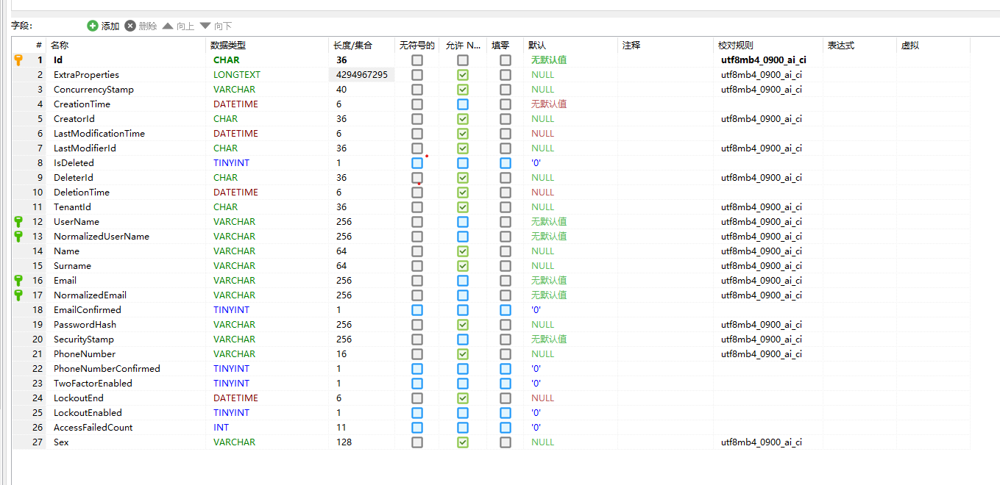

# 数据迁移上下文

abp的dbcontext是分成两种的,一个是程序运行的dbcontext,一个是数据迁移的dbcontext

`PlayGroundMigrationsDbContext.cs`

```
        protected override void OnModelCreating(ModelBuilder builder)
        {
            base.OnModelCreating(builder);

            /* Include modules to your migration db context */

            builder.ConfigurePermissionManagement();
            builder.ConfigureSettingManagement();
            builder.ConfigureBackgroundJobs();
            builder.ConfigureAuditLogging();
            builder.ConfigureIdentity();
            builder.ConfigureIdentityServer();
            builder.ConfigureFeatureManagement();
            builder.ConfigureTenantManagement();

            /* Configure your own tables/entities inside the ConfigurePlayGround method */

            builder.ConfigurePlayGround();
            builder.ConfigureBlogging();
        }
```

`PlayGroundDbContext.cs`

```
        protected override void OnModelCreating(ModelBuilder builder)
        {
            base.OnModelCreating(builder);

            /* Configure the shared tables (with included modules) here */

            builder.Entity<AppUser>(b =>
            {
                b.ToTable(AbpIdentityDbProperties.DbTablePrefix + "Users"); //Sharing the same table "AbpUsers" with the IdentityUser

                b.ConfigureByConvention();
                b.ConfigureAbpUser();

                /* Configure mappings for your additional properties
                 * Also see the PlayGroundEfCoreEntityExtensionMappings class
                 */
            });
 
            /* Configure your own tables/entities inside the ConfigurePlayGround method */

            builder.ConfigurePlayGround();
        }
```

我们看到他们共同执行了 builder.ConfigurePlayGround();

## 为什么这样设计?

- 为了模块间不产生依赖,例如用户表,迁移dbcontext中使用了IdentityUser,而运行的dbcontext使用了appuser进行了对其的映射,https://github.com/abpframework/abp/issues/1998
- 如何为user添加属性.https://github.com/abpframework/abp/issues/2453

# 如何共用user

我们来看下定义的Iuser接口

```
    public interface IUser : IAggregateRoot<Guid>, IMultiTenant
    {
        string UserName { get; }

        [CanBeNull]
        string Email { get; }

        [CanBeNull]
        string Name  { get; }

        [CanBeNull]
        string Surname { get; }

        bool EmailConfirmed { get; }

        [CanBeNull]
        string PhoneNumber { get; }

        bool PhoneNumberConfirmed { get; }
    }
```

dbcontext中的配置字段

```
        public static void ConfigureAbpUser<TUser>(this EntityTypeBuilder<TUser> b)
            where TUser : class, IUser
        {
            b.Property(u => u.TenantId).HasColumnName(nameof(IUser.TenantId));
            b.Property(u => u.UserName).IsRequired().HasMaxLength(AbpUserConsts.MaxUserNameLength).HasColumnName(nameof(IUser.UserName));
            b.Property(u => u.Email).IsRequired().HasMaxLength(AbpUserConsts.MaxEmailLength).HasColumnName(nameof(IUser.Email));
            b.Property(u => u.Name).HasMaxLength(AbpUserConsts.MaxNameLength).HasColumnName(nameof(IUser.Name));
            b.Property(u => u.Surname).HasMaxLength(AbpUserConsts.MaxSurnameLength).HasColumnName(nameof(IUser.Surname));
            b.Property(u => u.EmailConfirmed).HasDefaultValue(false).HasColumnName(nameof(IUser.EmailConfirmed));
            b.Property(u => u.PhoneNumber).HasMaxLength(AbpUserConsts.MaxPhoneNumberLength).HasColumnName(nameof(IUser.PhoneNumber));
            b.Property(u => u.PhoneNumberConfirmed).HasDefaultValue(false).HasColumnName(nameof(IUser.PhoneNumberConfirmed));
        }
```

dbcontext中的user表是如何创建,更新和使用的..`UserLookupService.cs`

先看下查找,其中`IdentityUserRepositoryExternalUserLookupServiceProvider : IExternalUserLookupServiceProvider,`

```
 public async Task<TUser> FindByIdAsync(Guid id, CancellationToken cancellationToken = default)
        {
            var localUser = await _userRepository.FindAsync(id, cancellationToken: cancellationToken);

            if (ExternalUserLookupServiceProvider == null)
            {
                return localUser;
            }

            if (SkipExternalLookupIfLocalUserExists && localUser != null)
            {
                return localUser;
            }

            IUserData externalUser;

            try
            {
                externalUser = await ExternalUserLookupServiceProvider.FindByIdAsync(id, cancellationToken);
                if (externalUser == null)
                {
                    if (localUser != null)
                    {
                        //TODO: Instead of deleting, should be make it inactive or something like that?
                        await WithNewUowAsync(() => _userRepository.DeleteAsync(localUser, cancellationToken: cancellationToken));
                    }

                    return null;
                }
            }
            catch (Exception ex)
            {
                Logger.LogException(ex);
                return localUser;
            }

            if (localUser == null)
            {
                await WithNewUowAsync(() => _userRepository.InsertAsync(CreateUser(externalUser), cancellationToken: cancellationToken));
                return await _userRepository.FindAsync(id, cancellationToken: cancellationToken);
            }

            if (localUser is IUpdateUserData && ((IUpdateUserData)localUser).Update(externalUser))
            {
                await WithNewUowAsync(() => _userRepository.UpdateAsync(localUser, cancellationToken: cancellationToken));
            }
            else
            {
                return localUser;
            }

            return await _userRepository.FindAsync(id, cancellationToken: cancellationToken);
        }
```

根据上面代码可见,如果找不到该用户..会自动创建一个,如何继承了IUpdateUserData则会更新

```
            if (localUser == null)
            {
                await WithNewUowAsync(() => _userRepository.InsertAsync(CreateUser(externalUser), cancellationToken: cancellationToken));
                return await _userRepository.FindAsync(id, cancellationToken: cancellationToken);
            }

            if (localUser is IUpdateUserData && ((IUpdateUserData)localUser).Update(externalUser))
            {
                await WithNewUowAsync(() => _userRepository.UpdateAsync(localUser, cancellationToken: cancellationToken));
            }
            else
            {
                return localUser;
            }
```

更新还可以通过eventbus

```
    public class BlogUserSynchronizer :
        IDistributedEventHandler<EntityUpdatedEto<UserEto>>,
        ITransientDependency
    {
        protected IBlogUserRepository UserRepository { get; }
        protected IBlogUserLookupService UserLookupService { get; }

        public BlogUserSynchronizer(
            IBlogUserRepository userRepository, 
            IBlogUserLookupService userLookupService)
        {
            UserRepository = userRepository;
            UserLookupService = userLookupService;
        }

        public async Task HandleEventAsync(EntityUpdatedEto<UserEto> eventData)
        {
            var user = await UserRepository.FindAsync(eventData.Entity.Id);
            if (user == null)
            {
                user = await UserLookupService.FindByIdAsync(eventData.Entity.Id);
                if (user == null)
                {
                    return;
                }
            }

            if (user.Update(eventData.Entity))
            {
                await UserRepository.UpdateAsync(user);
            }
        }
    }
```


# 如何给IdentityUser添加额外的属性

## Extra Properties

首先IdentityUser已经被定义,虽然我们可以通过dbcontext配置修改数据表的字段,,但是不能被映射,所以有了Extra Properties

https://docs.abp.io/zh-Hans/abp/latest/Customizing-Application-Modules-Extending-Entities

## 映射

会在数据库中创建字段

`AppUser.cs`

```
        public virtual string Sex { get; private set; }

        private AppUser()
        {

        }
```

`PlayGroundDbContext.cs`

```
            builder.Entity<AppUser>(b =>
            {
                b.ToTable(AbpIdentityDbProperties.DbTablePrefix + "Users"); //Sharing the same table "AbpUsers" with the IdentityUser

                b.ConfigureByConvention();
                b.ConfigureAbpUser();

                /* Configure mappings for your additional properties
                 * Also see the PlayGroundEfCoreEntityExtensionMappings class
                 */

                b.Property(x => x.Sex).HasMaxLength(128);
            });
```

`PlayGroundEfCoreEntityExtensionMappings.cs`

```
       public static void Configure()
        {
            PlayGroundModulePropertyConfigurator.Configure();

            OneTimeRunner.Run(() =>
            {
                /* You can configure entity extension properties for the
                 * entities defined in the used modules.
                 *
                 * The properties defined here becomes table fields.
                 * If you want to use the ExtraProperties dictionary of the entity
                 * instead of creating a new field, then define the property in the
                 * PlayGroundDomainObjectExtensions class.
                 *
                 * Example:
                 *
                 * ObjectExtensionManager.Instance
                 *    .MapEfCoreProperty<IdentityUser, string>(
                 *        "MyProperty",
                 *        b => b.HasMaxLength(128)
                 *    );
                 *
                 * See the documentation for more:
                 * https://docs.abp.io/en/abp/latest/Customizing-Application-Modules-Extending-Entities
                 */

                ObjectExtensionManager.Instance
                      .MapEfCoreProperty<IdentityUser, string>(
                  nameof(AppUser.Sex),
                  b => b.HasMaxLength(128)
                      );
            });
        }
```

我们来看看生成的迁移表

```
    public partial class Added_Sex_T_User : Migration
    {
        protected override void Up(MigrationBuilder migrationBuilder)
        {
            migrationBuilder.AddColumn<string>(
                name: "Sex",
                table: "AbpUsers",
                maxLength: 128,
                nullable: true);
        }

        protected override void Down(MigrationBuilder migrationBuilder)
        {
            migrationBuilder.DropColumn(
                name: "Sex",
                table: "AbpUsers");
        }
    }
```



它时如何被添加到迁移dbcontext中的

`AbpEntityTypeBuilderExtensions.cs`

```
        public static void ConfigureByConvention(this EntityTypeBuilder b)
        {
            b.TryConfigureConcurrencyStamp();
            b.TryConfigureExtraProperties();  //配置扩展属性,就是ExtraProperties字段
            b.TryConfigureObjectExtensions();//就是这里对象扩展,ObjectExtensionManager.Instance添加属性,然后从这里再根据类型读取出来
            b.TryConfigureMayHaveCreator();
            b.TryConfigureMustHaveCreator();
            b.TryConfigureSoftDelete();
            b.TryConfigureDeletionTime();
            b.TryConfigureDeletionAudited();
            b.TryConfigureCreationTime();
            b.TryConfigureLastModificationTime();
            b.TryConfigureModificationAudited();
            b.TryConfigureMultiTenant();
        }
```


## 同步

你可以创建**自己的表**来存储属性,而不是创建新实体并映射到同一表. 你通常复制原始实体的一些值. 例如可以将 `Name` 字段添加到你自己的表中,它是原表中 `Name` 字段的副本.

在这种情况下你不需要处理迁移问题,但是需要处理数据复制问题. 当重复的值发生变化时,你应该在表中同步相同的变化. 你可以使用本地或分布式[事件总线](https://docs.abp.io/zh-Hans/abp/latest/Event-Bus)订阅原始实体的更改事件. 这是根据来自另一个微服务的数据推荐的方法,特别是如果它们有单独的物理数据库(你可以在网络中搜索关于微服务设计的数据共享,这是一个广泛的主题).