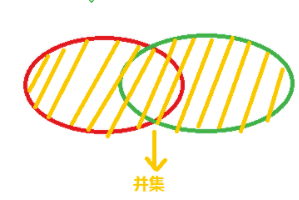
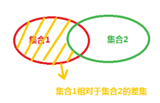
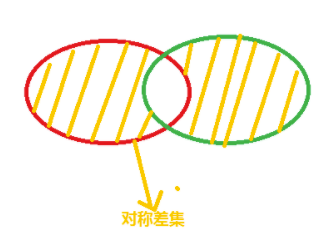
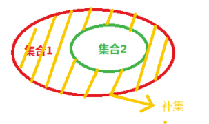

假如有类型 Show 的定义如下

```
十進位表示法
[Flags]
enum Days
{
    None      = 0,  // 0000 0000
    Sunday    = 1,  // 0000 0001
    Monday    = 2,  // 0000 0010
    Tuesday   = 4,  // 0000 0100
    Wednesday = 8,  // 0000 1000
    Thursday  = 16, // 0001 0000
    Friday    = 32, // 0010 0000
    Saturday  = 64  // 0100 0000
}
位元移位表示法
[Flags]
enum Days
{
    None      = 0,      // 0000 0000
    Sunday    = 1 << 0, // 0000 0001
    Monday    = 1 << 1, // 0000 0010
    Tuesday   = 1 << 2, // 0000 0100
    Wednesday = 1 << 3, // 0000 1000
    Thursday  = 1 << 4, // 0001 0000
    Friday    = 1 << 5, // 0010 0000
    Saturday  = 1 << 6  // 0100 0000
}
二進位表示法 (C# 7.2新增)
[Flags]
enum Days
{
    None      = 0b_0000_0000, // 0000 0000
    Sunday    = 0b_0000_0001, // 0000 0001
    Monday    = 0b_0000_0010, // 0000 0010
    Tuesday   = 0b_0000_0100, // 0000 0100
    Wednesday = 0b_0000_1000, // 0000 1000
    Thursday  = 0b_0001_0000, // 0001 0000
    Friday    = 0b_0010_0000, // 0010 0000
    Saturday  = 0b_0100_0000  // 0100 0000
}
 
十六進位表示法
[Flags]
enum RenderType
{
   None = 0x0,
   DataUri = 0x1,
   GZip = 0x2,
   ContentPage = 0x4,
   ViewPage = 0x8,
   HomePage = 0x10 // Next two values could be 0x20, 0x40
}
```


- & 按位与
- | 按位或
- ^ 按位异或
- ~取反

## 并集

a|b: 并集(所有的和,相同部分只算一次);

```
>>> A = {'数学','语文','英语','物理','化学','生物'}
>>> B = {'数学','语文','英语','政治','地理','历史'}
>>> A | B
{'英语', '物理', '语文', '政治', '化学', '数学', '生物', '地理', '历史'}
```



## 差集

```
>>> A = {'数学','语文','英语','物理','化学','生物'}
>>> B = {'数学','语文','英语','政治','地理','历史'}
>>> A & (~B)
{'物理', '生物', '化学'}
>>> B & (~A)
{'政治', '历史', '地理'}
  
```



## 补集(对称差集)

```
>>> A = {'数学','语文','英语','物理','化学','生物'}
>>> B = {'数学','语文','英语','政治','地理','历史'}
>>> A ^ B
{'物理', '生物', '化学', '政治', '历史', '地理'}
```







## 交集

```
>>> A = {'数学','语文','英语','物理','化学','生物'}
>>> B = {'数学','语文','英语','政治','地理','历史'}
>>> A & B
{'英语', '语文', '数学'}
```
或者
```
  Show show = Show.A | Show.B;
  show.HasFlag(Show.A);
```
从性能上看通过 `&` 的性能会比 HasFlag 高，但是从可读性上 HasFlag 更友好，如果你的代码没有性能问题推荐使用 HasFlag 方法

