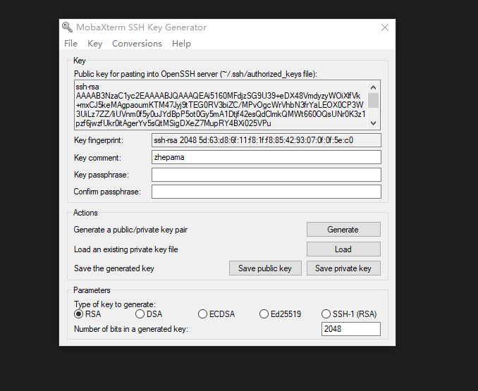
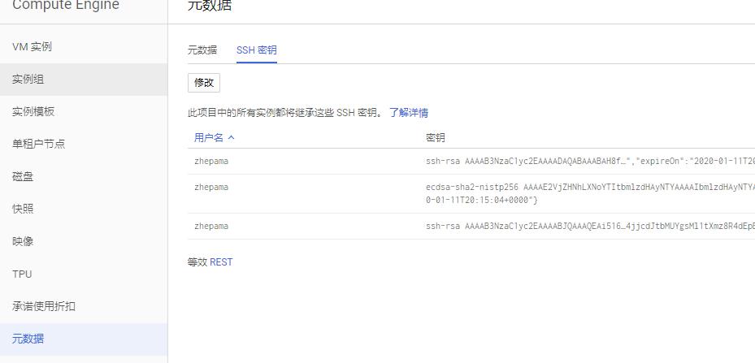
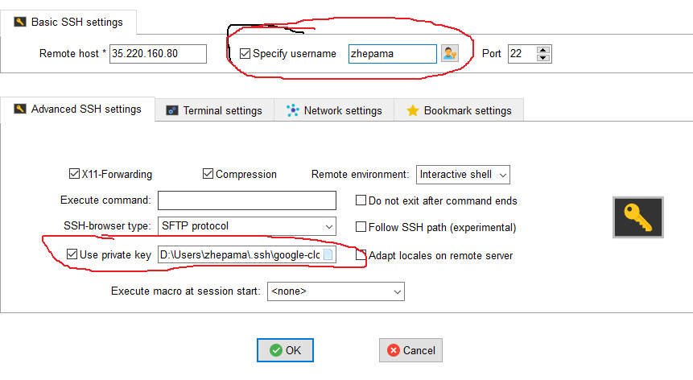
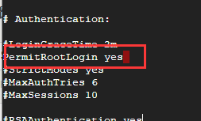
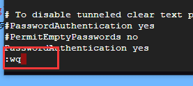

#  使用普通用户登陆

### 生成私钥


生成后可以把 Key comment 改为你想要的名称, 这样下面你在连接的时候可以使用比较熟悉的Username 作为登录名, 然后使用 Ctrl + C 把上面显示的那串 ssh-rsa.. 开头的公钥复制下来. 待会要用到这个.



然后保存好你的私钥和公钥到本地目录中..私钥是`本地`用的,公钥是`远程服务器`用的

# 添加公钥到谷歌云的实例中


点击实例的名称进入实例的详情后. 进入页面后点击上方的修改, 然后拉到下方找到如下图的地方点击添加一项, 把刚刚复制的公钥粘贴进去, 记得, 正确的公钥是在结尾会有一个空格加上你的 Username , 例如: “…== qian” 


# 使用SSH工具连接到实例




# 使用 root 账户登陆和修改root密码

### 先选择从浏览器打开ssh连接服务器
[](https://ycb.hk/usr/uploads/2018/03/2557178057.png)
连接登录成功后，输入以下命令

```
sudo -i  #切换到root
passwd   #修改密码
```

[](https://ycb.hk/usr/uploads/2018/03/2932129962.png)
然后会要求输入新密码，然后再重复一次密码，输入密码的时候不会显示出来，所以直接输入密码，然后回车，再然后重复输入密码回车。

修改root密码完成

### 接着修改SSH配置文件/etc/ssh/sshd_config

```
vi /etc/ssh/sshd_config #编辑文件
```

然后再输

```
i   #进入编辑模式
```

找到以下内容并修改

```
PermitRootLogin yes //默认为no，需要开启root用户访问改为yes
PasswordAuthentication yes //默认为no，改为yes开启密码登陆
```

[](https://ycb.hk/usr/uploads/2018/03/3324977715.png)
修改完成后，再下按 esc 键，然后再输入

```
:wq   #保存并退出
```

[](https://ycb.hk/usr/uploads/2018/03/1145294211.png)
最后重启下服务器即可

```
reboot    #重启服务器
```