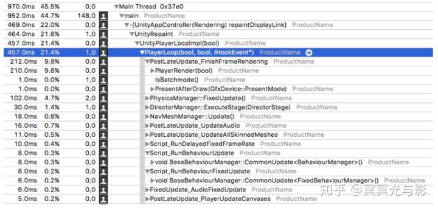

**性能分析：**

所有尝试优化的操作都是从发现问题开始的，在谈论性能时，这是非常重要的。对一个应用进行性能分析，第一步是根据性能分析的结果，找出它的瓶颈。然后再优化项目中的用到的技术和资源的结构。

提示：本节性能分析中出现的方法名称，都是从unity5.3中提取的，方法名可能在以后的Unity版本中发生变化。

**工具：**

对于unity开发者来说，性能分析的工具有很多种。Unity有一系列的内置工具，比如CPU Profiler，Memory Profiler和5.3中新加的Memory Analyzer。

然而最好的分析数据通常来自于特定平台的工具。其中包括：

IOS:Instruments和XCode Frame Debugger

Android:Snapdragon Profiler

运行因特尔CPU/GPU的平台：VTune和Intel GPA

PS4:Razor系列

Xbox：Pix工具

这些工具通常能分析用IL2CPP打包出来的C++项目。这些本地代码版本中，能清晰的看到堆栈调用和各类方法的执行时间，如果用Mono编译，是做不到这些的。

关于IOS设备上怎么进行性能分析，Unity官方有一个基本的介绍。请看：

[Profiling with Instruments – Unity Blogblogs.unity3d.com!](https://blogs.unity3d.com/cn/2016/02/01/profiling-with-instruments/%3F_ga%3D2.53202159.65875105.1532310232-165234103.1528100648)

**启动流程剖析：**

当查看启动流程的时间时，有两个方法需要注意。在那些影响启动时间的配置文件、资源和工程代码中，这两个方法起着重要的作用。

在不同的平台上，启动时间是不同的。在大多数平台上，Splash Image显示的时间，就是启动的时间。

上面的截图来自于在iOS设备上运行的一个示例项目。在此平台的startUnity方法中，请注意UnityInitApplicationGraphics和UnityLoadApplication方法。

UnityInitApplicationGraphics执行了大量的内部操作，例如设置图形设备和初始化许多Unity的内部系统。另外，为了初始化Resource系统，它必须加载Resource系统所包含下标的所有文件。每个名为“Resources”的文件夹中的每一个资源文件（注意：这只适用于项目“Assets”文件夹中名为“Resources”的文件夹，以及“Resources”文件夹中的所有子文件夹）都包含在Resource系统的数据中。因此，初始化Resource系统所需的时间与“Resource”文件夹中的文件数量至少呈线性关系。

UnityLoadApplication包含加载和初始化第一个场景的方法。在项目中，这包括把需要在第一个场景里需要显示的所有数据进行反序列化和实例化。比如，编译着色器，上传贴图和实例化GameObjects。另外，第一个场景中，所有继承了MonoBehaviour脚本中的Awake方法都会在这个时候被回调。

这些过程意味着，如果在项目的第一个场景中，在Awake方法中有长时间运行的代码，那么该代码就会增加项目的启动时间。为了避免这一问题，在Awake方法中不能放运行时间长的代码，或者把这些代码放到程序的其他其他生命周期里。

**运行时流程分析：**

在初始化启动之后的性能分析中，最主要的是PlayerLoop方法。这个是Unity的主循环，并且每一帧都会被执行一次。

上面的截图来自Unity5.4一个示例项目的性能分析。它展示了PlayerLoop中几个最有趣的方法。请注意，不同Unity版本之间，PlayerLoop中的方法名称可能有所不同。

PlayerRender是运行在Unity渲染系统中的方法。它包括对象剔除，计算动态批次，向GPU提交绘制命令。任何的后处理效果（Image Effects）或基于渲染的脚本回调（比如OnWillRenderObject）也都在这里运行。通常来讲，在具有交互的项目中，这个方法也是最影响GPU性能的。

BaseBehaviourManager调用了三个类型的CommonUpdate方法。它会调用当前场景中，挂在激活的物体上面的Monobehaviours里的特定方法。

- CommonUpdate<UpdateManager> 回调 Update
- CommonUpdate<LateUpdateManager> 回调 LateUpdate
- CommonUpdate<FixedUpdateManager> 如果勾选了物理系统，就会回调 FixedUpdate

通常，检测BaseBehaviourManager::CommonUpdate<UpdateManager>这类方法是最有趣的，因为它是多数Unity项目脚本运行的入口。

有几个其他的方法也可以注意一下：

如果项目用到了Unity的UI系统，UI::CanvasManager就会回调几个不同的方法。包括Unity UI的批次计算和布局更新，在CanvasManager中，这两个方法也是比较常用并且比较重要的方法。

DelayedCallManager::Update运行协程。这部分内容在之后的”Coroutines”的章节会详细的介绍（如果我能坚持的话，哈哈哈）或者参考官方文档

[Unity - Manual: Coroutinesdocs.unity3d.com!](https://docs.unity3d.com/Manual/BestPracticeUnderstandingPerformanceInUnity3.html)

PhysicsManager::FixedUpdate执行PhysX物理引擎。它主要涉及到执行PhysX的内部代码，并且也手当前场景中物理对象数量的影响。比如Rigidbodies和Colliders。然而，基于物理的回调也会在OnTriggerStay和OnCollisionStay中出现。

如果项目有用到2D物理系统。那么在Physics2DManager::FixedUpdate中也会出现类似的调用。

**脚本方法剖析：**

当脚本用IL2CPP编译跨平台编译时，找到包含ScriptingInvocation对象这行。这是Unity为了执行脚本代码，从内部代码过渡到运行时脚本的一个时间点（注意：从技术上讲，通过运行IL2CPP，C#和JS脚本也变成了本地代码。然而，这种编译的代码主要通过IL2CPP运行时框架执行方法，这跟手写的C++代码不太相似）。

上面的截图来自一个Unity5.4示例项目中的另一个的性能分析。RuntimeInvoker_Void这一行下面的所有方法都是C#脚本编译的，它们每帧都会被执行一次。

分析报告阅读起来比较容易：每一个都是类名+“_”+方法名。在上图中，我们可以看到EventSysten.Update，PlayerShooting.Update和几个其他的Update方法，这些是大多数MonoBehaviours脚本中比较标准的Unity Update回调。

展开这些方法，可以清楚的看到那些正在占用CPU的方法。其中也会包括项目中被用到的Unity API和C#类库的方法。

上图的分析中，也显示了StandaloneInputModule.Process，这个方法会在每一帧都用射线穿过整个UI，为了检测是否有点击事件或者滑动事件触发。这个对性能的主要影响是需要遍历所有的UI元素，并且监测鼠标的位置是否在UI元素的边界内。

**资源加载：**

资源加载主要是通过SerializedFile::ReadObject方法来实现的。在对CPU性能分析时，就可以找到这个方法。SerializedFile::ReadObject通过Transfer方法，把文件的二进制数据关联到Unity的序列化系统。所有的Asset类型中，都能找到这个Transfer方法，比如Texttures，MonoBehaviours 和Particle Systems。

在上面的截图中，一个场景正在被加载。SerializedFile::ReadObject下面调用的不同Transfer方法表明了Unity正在读取并且反序列化场景中所有的Assets。

通常，如果运行时遇到了性能问题，在加载资源时帧率下降，并且通过性能分析是由于SerializedFile::ReadObject这个方法造成的。请注意，在多数情况下，只有当通过SceneManager, Resources 或者 AssetBundle API进行同步加载资源时，SerializedFile::ReadObject才会出现在主线程里。

避免出现这种性能问题，常规的做法是：你可以使用异步加载资源（这就把大量的ReadObject操作丢给了工作线程），或者提前加载好比较大的资源。

注意，当克隆objects时，Transfer也会被调用（在性能分析时出现的CloneObject就是）。如果CloneObject方法下面出现了Transfer方法，这说明资源不是正在从储存器上加载，而是在克隆老的对象。这个过程是：Unity先把老对象序列化，再反序列化数据作为新的对象。

本文翻译自Unity官方文档：

[Unity - Manual: Profilingdocs.unity3d.com!](https://docs.unity3d.com/Manual/BestPracticeUnderstandingPerformanceInUnity1.html)

**Q1：第一次启动项目会有冷启动时间过长的情况，请问该怎么优化？**

> 首先肯定是判断游戏在冷启动过程中是在做什么事情消耗了时间，然后针对性地优化。还有就是定义好冷启动的界限，从点击游戏到Unity的闪屏出现这段时间通常定义为冷启动的时间，但是我们项目后来发现在做启动的优化的时候还有很长时间花费在游戏启动之后的一些资源初始化方面。
>
> 我在优化启动时间的过程中没有使用什么特别多的工具，主要是基于mlogcat.exe查看设备上输出信息的log，结合自己加入的一些log来做问题的排查。
>
> 纯粹的冷启动时间过长，会和Resources目录下的资源有关系，越多越慢。我们是以AssetBundle的方式为主，所以这块注意了下，清理了一些插件引入的确定不需要的资源（直接看打包好的apk里的内容来排查）。另外搜索下还有一些文章说相关问题，可以关注下，这里不赘述。
>
> [Unity 冷启动简介](https://blog.csdn.net/qq_34307432/article/details/84023894)
> [Unity3D游戏如何加快冷启动时间](http://gad.qq.com/article/detail/32076)
> [如何改进Unity3d手游启动速度？](https://www.zhihu.com/question/55441136)
> [Unity启动耗时优化](https://www.jianshu.com/p/4366da6dd4a1)
>
> 说一下我们遇到的游戏启动时间过长时解决过的几个问题。我们定义启动时间是从点击app图标到进入游戏Patch界面（即游戏逻辑接管）这段时间。
> 1）Shader编译时长。如果只有游戏安装之后第一次启动时间过长，一个很大的可能是shader编译，之后游戏启动因为有了Cache所以会快很多。这种情况的话建议查看下Always Include的Shader内容和变体，使用shadervariantcollection等方案替代。
>
> 2）Tolua绑定和Lua资源加载。这种是每次游戏启动都会有的，ToLua接口绑定需要一定的时间，我们在确保前期不会使用Lua的情况下采用多线程的方式进行绑定和加载，保证主线程不会卡住。
>
> 3）注意设置Web请求的超时时长。我们在游戏启动的时候做了一些hook的事情，会有Web请求，后来我们遇到一个情况是在很多机器上会黑屏等待30s甚至60s这样的时长，后来发现是因为这个Web请求没有设置超时时间，于是使用了机器默认的超时时间，在不同设备上不同，比如红米2A上会有接近1分钟的超时限制。这个很坑，只是因为那个非必须的Web服务没有正确开启，导致排查了很长时间。
> Native层增加界面，减少黑屏等待，提升玩家体验。这个并不能真正解决问题，只是一种缓解手段，等到优化做到位了，其实也就不需要了。
> 说的内容大都是启动时间而非冷启动，供题主参考。建议题主多看看Unity进程的输出log，可能会有意外发现，通常情况下，不使用Resources的方式的话，在没Bug的情况下冷启动时间应该不会很长，我们因为没怎么用这种方式，所以不是很清楚。这个链接可以参考下：https://www.jianshu.com/p/4366da6dd4a1

## 脚本编译顺序

对于大型项目来说，这确实是大家经常遇到的情况。一般来说，Unity Editor会按照脚本的依赖关系编译代码，其主要分为以下四个步骤：
编译Standard Assets、Pro Standard Assets和Plugins文件夹中的Runtime Script；
编译以上三个文件夹中Editor文件夹下的Script；
编译项目中所有剩余的Runtime Script（Editor文件夹以外Script；
编译剩余Script（即Editor文件夹中Script）。
知道了Unity编辑器的脚本编译特性后，我们则建议研发团队可以将一些长时间不需要改动的脚本代码（比如各种插件代码）放入到Standard Assets、Pro Standard Assets或Plugins文件夹中，这样这些代码只需要编译一次，后续的时间就都能节省下来。有朋友做过测试，在他们的项目中经过上面的改动，原来项目每次的编译时间从23s下降到7s。想想看，这将节省你和你的团队多少时间！

https://docs.unity3d.com/Manual/ScriptCompileOrderFolders.html