作者：哈里叔叔
链接：https://www.zhihu.com/question/52019284/answer/1476187895
来源：知乎
著作权归作者所有。商业转载请联系作者获得授权，非商业转载请注明出处。

### 对称性对抗游戏简介

对称性对抗游戏是指参与游戏的玩家所拥有的资源、交互方式、受制规则、最终目标是相同或相近的，是一种公平、对称的零和游戏。如《英雄无敌》《文明》《卡坦岛》等游戏。

我们参考文明的4X要素[[1\]](#ref_1)搭建了一个多人回合制战略游戏，如下图所示：地图开始被“战争迷雾”所覆盖。玩家必须派遣探险者进入这片迷雾中，以揭露要扩张的土地，要开发的资源以及要消灭的对手。

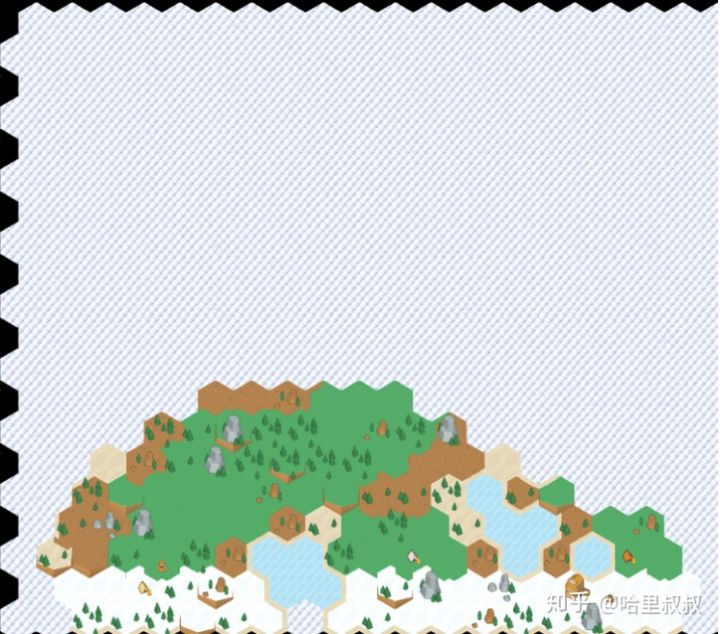

### 地图的平衡性指标

我们参考[[2\]](#ref_2)[[3\]](#ref_3)两篇参考文献制定出评估对称性对抗游戏地图平衡性的两点指标。

**1. 战略特征（Strategic Feature）**

战略特征是指玩家在游戏中可以利用的战略资源。 战略特征的平衡是指每一名玩家在一定时间内获得基本相同的资源（包括类型和数量）。

下面两张图显示了两名玩家战略特征不平衡的情况，蓝色玩家初始时可以获得更多的矿产资源，而黄色玩家的出生点附近几乎没有矿产资源，这会导致游戏初期黄色玩家的发展受限。

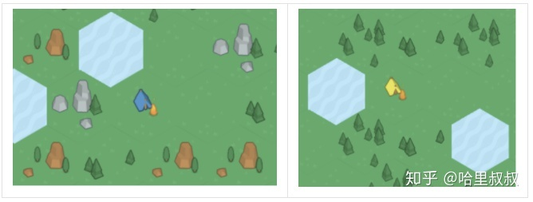

**2. 玩家占位符（player placeholder）**

玩家初始的出生点占位的分布也会影响游戏的平衡性。

下面两张图显示了玩家初始占位符分布密度不同导致游戏性不平衡的情况。左图的玩家初始分布密集，这会导致这个地区的玩家在游戏前期相互碾压、发展受限；而右图中的黄色玩家在游戏前期缺少竞争，能够更好地发展自身建设。

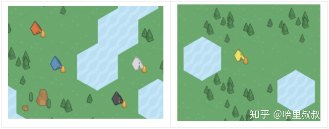

除了以上两点对游戏平衡性的影响之外，战略游戏地图的随机地图还要考虑到：地图的美观性、根据玩家的偏好定制参数、生成地图的效率等要求。

### 地图的生成过程

**1. 根据玩家的偏好定制地图参数**

在新建游戏之前，我们会让玩家根据自己的喜好定制地图参数，包括地图的尺寸、玩家的总数量、地图的类型（盘古大陆、大洲、海岛群）、水体比例、植被比例、岩石比例与资源的比例等。

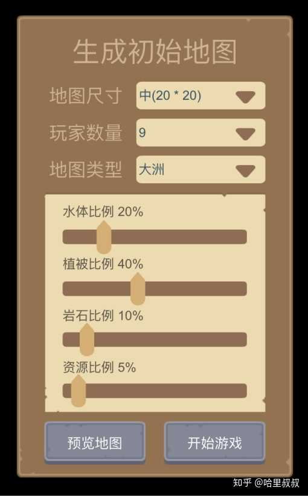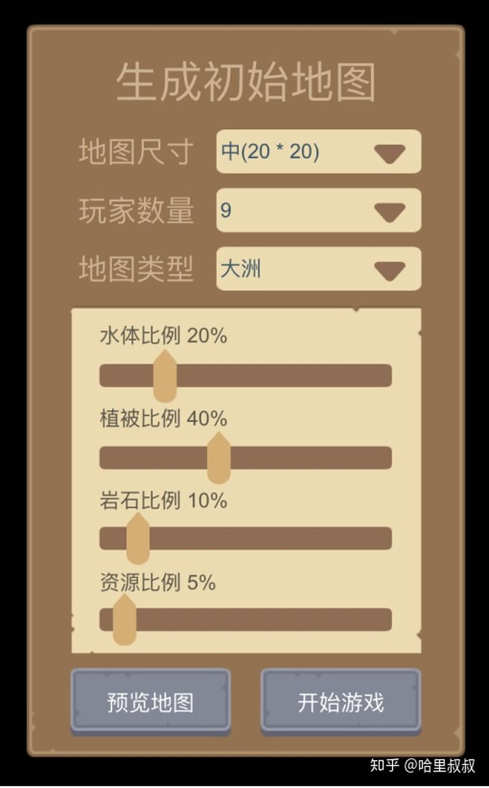

**2. 生成地图的轮廓：柏林噪声**

柏林噪声（Perlin noise）指由Ken Perlin发明的自然噪声生成算法[[4\]](#ref_4)。在游戏开发领域，柏林噪声可以用于生成波形，起伏不平的材质或者纹理。如下图所示：

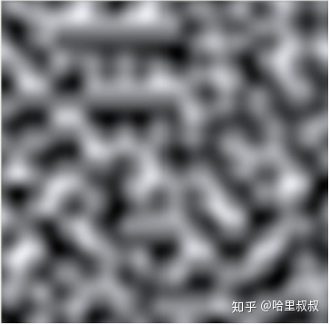

与椒盐噪声相比，柏林噪声有较好的连续性分布，可以更好的模拟自然界中的地形分布与地表装饰物分布。利用柏林噪声生成自然地图可以参考B站视频：[柏林噪声程序化生成随机地图](https://link.zhihu.com/?target=https%3A//www.bilibili.com/video/BV1sJ411e7nt)[[5\]](#ref_5)。

柏林噪声的生成采用伪随机数的生成方式，相同的“随机数种子”会生成相同的地貌。这也是很多随机地图生成器中会暴露“种子”让玩家根据种子生成地图的原因。如果想跟好朋友分享某个生成结果比较好的地图，只需要共享“种子”字符串，就能在随机地图生成器中还原出所生成的地形，而不需要把整个地图文件保存到本地再分享。

Unity官方自带生成柏林函数的函数。我们引用了柏林噪声js库来进行地形的实现。我们利用柏林噪声的采样尺度来决定地图的类型是连续的大陆型地图还是离散的大洲型地图；将随机取到的连续噪声均衡化作为地图的高度图，根据用户设置的水体占比来制定海平面高度，最终生成的地形结果如下图所示： 

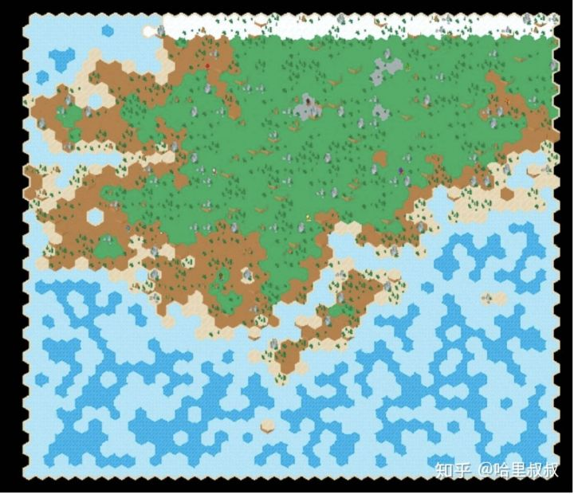

**3. 玩家出生点的选择：米切尔最佳候选算法**

为了保证每位玩家两两之间的初始分布不会过近，我们在生成游戏地形后，在陆地上对玩家初始占位符进行均匀采样。为了兼顾效果与效率，我们最终选用米切尔最佳候选 算法（best candidate）。

米切尔最佳候选算法是一种渐进、增量式的均匀采样方法。它每一轮采样都是从多个随机采样点中，保留与之前轮的所有采样点中最小距离最大的点作为本轮的采样结果。更加具体直观的算法解释可以参考:[算法可视化](https://link.zhihu.com/?target=https%3A//bindog.github.io/blog/2014/08/09/visualizing-algorithms/)[[6\]](#ref_6)中有关米切尔候选算法的部分

如下图所示：黑色点是之前轮已经确定的采样点，灰色点是本轮随机采样的候选点，每个候选点都选出与之前轮采样点中距离最近的距离，再从中选出最小距离最大的红色点作为本轮采样的结果。

利用这种采样方式采样出玩家的初始占位符，可以避免任意两个玩家之间的距离过近导致游戏平衡性被破坏，如下图所示：

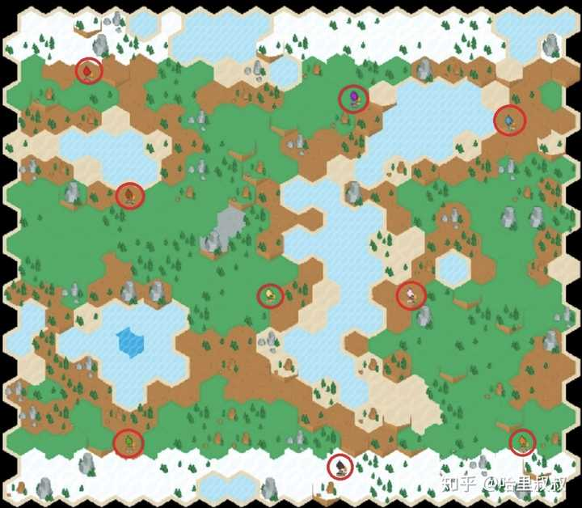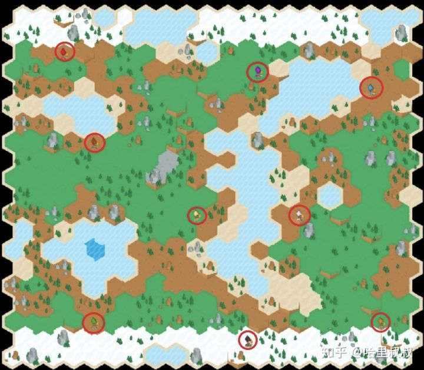

**4. 战略资源的分布**

采样出玩家的分布之后，我们将地图单元格分为两种类型：每个玩家占位符附近距离N以内的单元格为玩家区域（Player Zones），不隶属于任何玩家区域的单元格被称为隔离区或自然区（Natural Zones）。

为了让每名玩家在游戏初始时具有公平的战略特征，我们对每位玩家的玩家区域内定额分配植被、岩石与矿产资源。根据用户设定的植被、岩石与资源占比分别计算出每位玩家区应当分配到的植被、岩石与资源数量，然后在每个玩家区域内不重不漏地采样出相等数量的植被、岩石与资源单元格。

对于自然区，我们按照玩家设置的参数，采用米切尔候选算法均匀采样每一种资源。这样可以保证每位玩家在游戏初始时能够得到数量一致的战略特征。如下图所示：

**5. 边界情况处理**

用以上方式生成的地图在某些情况下会产生不好的结果，例如当水体比例过低时生成海岛地形，会导致水体不够划分不出海岛地形；当水体比例过高时，会由于陆地单元格分布不均导致出生在不同规模大小的岛屿上的玩家能够得到的战略资源再度失衡。对于这些边界情况，我们利用种子生长与泛洪填充等启发式生成方法生成地图，优先保证地图类型能够满足用户的需求，并尽可能保证水体与各种战略特征的资源逼近用户的设定。以下是我们在水体占比过低与水体占比过高时生成的地图，可以看出在这两种情况下依然能够保证所生成地图的平衡性：

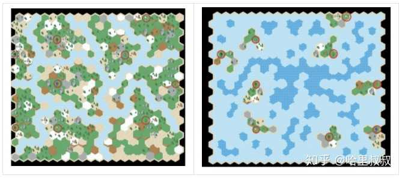

### 生成地图质量的定量评估

为了判断我们的生成随机地图算法是否具有良好的平衡性指标，我们设计了一套地图自动扩张算法：每个玩家以出生点占位符为种子，轮流从目前领土所毗邻的无人单元格中抽取一个进行占领以扩张势力范围，直到地图中所有的单元格都被有且只有一个玩家占领；然后我们统计每个玩家占领到的资源数量、距离最近的敌人距离，以及每个玩家与多少数量的玩家领土相邻。如下图所示： 

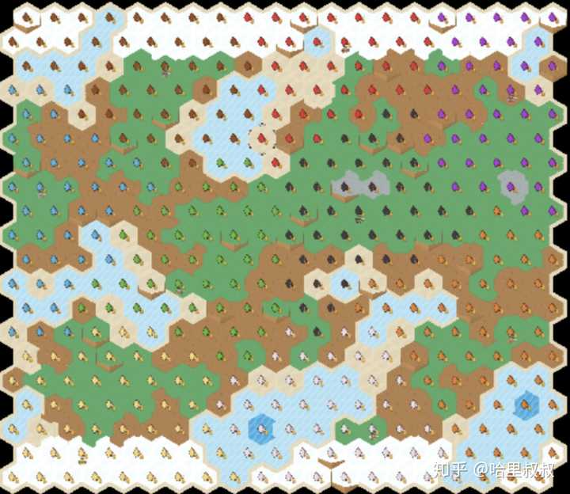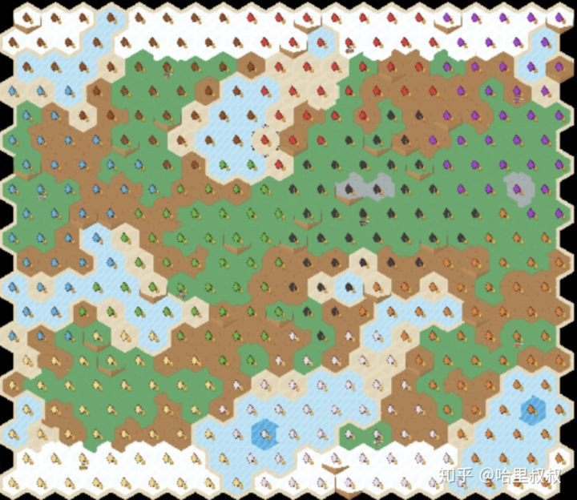

实验组是我们的算法生成的地图，对照组是根据水体与各种资源的比例随机采样地形、随机采样玩家分布得到的地图。如下方左侧是实验组生成的地图，右侧是对照组生成的地图：

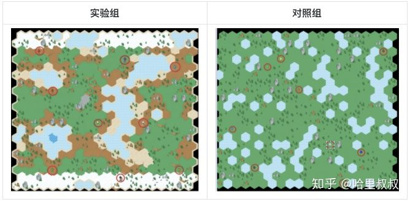

实验组与对照组各生成100次地图，统计每个玩家与其他势力最小距离的均值与方差、扩张完成后各资源占有量的均值与方差以及每位玩家潜在冲突势力的均值与方差，统计的结果如下所示：

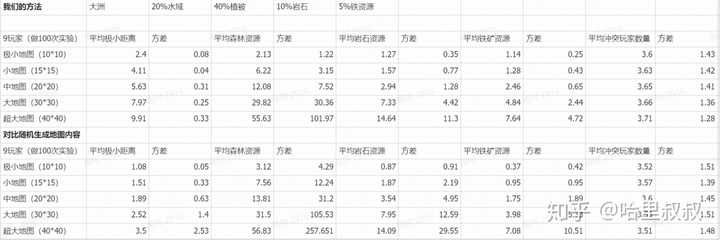

通过定量的统计结果可以看出，我们的方法生成的地图，玩家之间有更大的平均极小距离，这说明每位玩家的出生点占位符设置更加平衡；各种资源的分布方差均比对照组小，说明我们的战略特征分配与朴素的随机生成的地图相比更加均衡。

综上所述，我们的地图生成结果能够保证对称性多人对抗战略游戏的平衡性。

### 