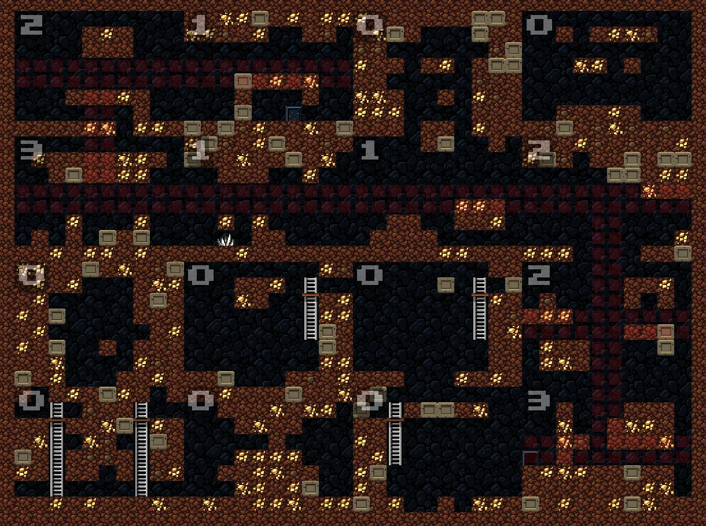
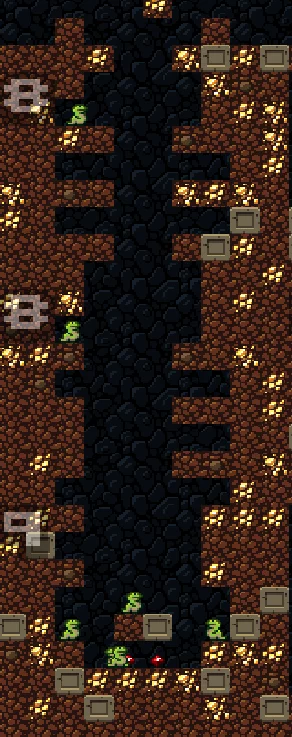
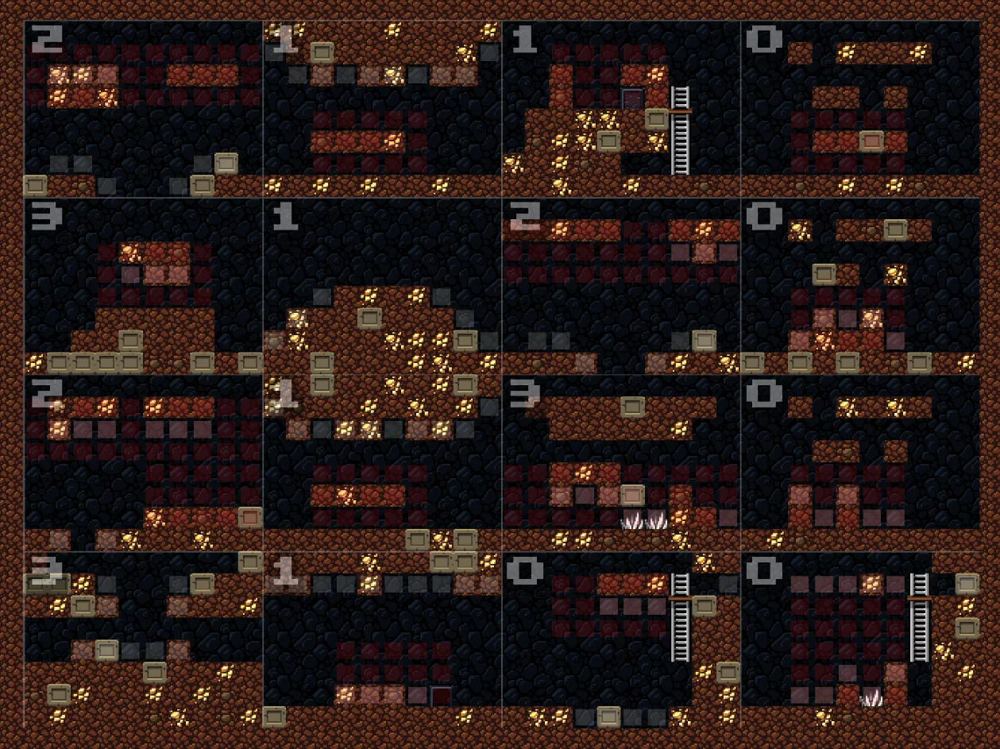
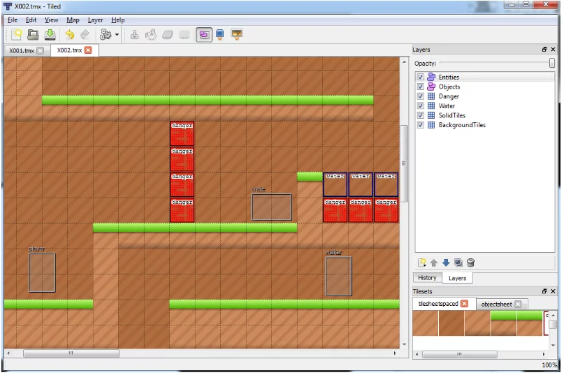

# Part1. 创建Solution path - 关卡通路

关卡生成算法的第一部分：生成关卡的critical path（关卡通路），我们先不考虑那些障碍物、陷阱、敌人和宝箱什么的。

算法的第一部分是生成关卡的 Critical Path（通路），关卡由 16 个房间按照 4x4 的网格组成。方法是先在第一排随机找到一个起始房间，然后随机使相邻的房间成为通路的一部分，一直到最后一排，生成出口。找到通路之后，连接这些房间，然后再随机补充上非通路部分的房间，打通这些房间。如图顺序所示：

然后为这些房间随机选取对应的预定义好的关卡模块。根据 Spelunky 的教学文章[[3\]](https://indienova.com/indie-game-development/the-procedurally-generated-map-of-dead-cells/#reference)，这里有 4 种不同的房间类型：

这个关卡由16个房间按照4x4的网格方式组成，这里有4种不同的房间类型：

- 0：不在critical path上，不会产生任何出口（可被忽略的）次要房间 (感谢洋芋君指出之前的翻译问题)
- 1：左右一定有出口
- 2：左右下一定有出口，如果有2号room在上方，也一定有上方出口
- 3：左右上一定有出口

第一步在最顶部这行随机选取一格创建一个Start Room，房间类型对开始的房间来说没太大影响。一般来说，Start Room类型我们会选1或者2。

每当一个Room被创建，首先总是类型1(左右)。

然后要决定往哪边走。取一个均匀分布的随机数，从1到5。当1或2时，critical path向左；当3或4时，critical path向右；当5时，path向下。（当critical path碰到屏幕边缘，立即向下移动并同时切换左右方向。）

这有个问题，如果我们向左或右移动，是OK的，因为我们创建的Room是一定有左右出口的。但我们要向下走，我们就得改变我们当前所在的房间了。所以生成器重写房间类型为2，覆盖当前的房间，现在我们可以向下移动了。

 当生成器移到下一个房间，会问我们最后创建的那个房间（也就是刚才我们头顶上那个）类型是不是2（底部有出口）。 如果是2，那么当前这个房间类型一定要是2或3（上方有出口）。因为2、3类型都有左右出口，启动算法从头再来一次。

如果到了底部这一行，我们要尝试向下，那肯定不行了，我们放置一个Exit Room来取代向下的房间。

现在我们已经生成了整个critical path（关卡通路，即图中那些暗红色的格子，游戏中是不显示的，这里只是为了举例）。接下来要做的最后一件事，我们要把4x4的网格中的空余部分放上类型为0的房间，这些房间并不在critical path上。这些房间在任何方向都不一定有出口，所以有时候会生成一些围墙。

如果一列中有3或者4个Room 0，那这一列房间有几率成为一个蛇窝。如果我们要生成蛇窝的话，从上到下，放一列房间，类型为7 8 9，或者7 8 8 9，取决于我们希望这个蛇窝有多深。(这里的蛇和宝石并不像其他敌人那样随机生成，因为它们是这种地形的一部分，所以位置基本是固定出现。）

*蛇窝*

# Part2. 创建房间 关卡生成算法的第二部分：生成Room，我们先不考虑那些障碍物、陷阱、敌人和宝箱什么的。

Spelunky并不像其他大部分游戏（平台游戏，platformer）在传统的2D tile-base的平台游戏中，你用关卡编辑器做出的地图可能看起来像这样：

在这种类型编辑器里，是这样的，比如，在（64,128）这个位置是草的tile。但Spelunky完全不是这样。
上一部分我们了解了Spelunky有4种基本房间类型（types）。这每个房间类型有8-16个模板。这些模板具备一个房间的基本布局，包括一些静态和概率tile的组合。
Room Templates（房间模板）
每个房间类型都有一堆不同的模板。
*译注：Derek Yu使用不同的布局，做了一系列的房间设计。比如你掉出去的房间（DROP）、掉入的房间（LANDING）、可以穿过的走廊（CORRIDOR）、不在关卡通路上的房间（NON-CRITICAL）。*

房间模板，嗯……看起来就像下面这样：

> > 1100000000
>
> > 40L6000000
>
> > 11P0000000
>
> > 11L0000000
>
> > 11L5000000
>
> > 1100000000
>
> > 1100000000
>
> > 1111111111

每个模板由10x8 的tile网格组成。"0"表示空，"1"表示100%是砖块，"L"是梯子，"P"是爬梯子上去的平台(platform)。现在你在看这个模板， 嗯，下面一排是地面，左边是2个tile宽的墙，上面有个小缺口，有个梯子可以爬到那。

Static and Probabilistic Tiles( 静态和概率Tile )

static tile就像传统关卡编辑器里一样，你让这里有个砖块，那这就永远是砖块了。

上面模板里的"4" tile，就是probabilistic tile。"4"表示那有25%的几率会是一个能推动的障碍物，出现在梯子的顶部旁边。有经验的Spelunky玩家会一下认出这个：有时你爬到一个梯子顶部，旁边有个障碍物，你得推它，就可以进到下一个房间。有时候爬到梯子顶上旁边就没有这玩意。还有比如“这有33%的几率会出现个尖刺”，或者“这有一半的几率是空的，或者是砖块”。

Obstacle Block( 障碍块）

"5"和"6"就是所谓的Obstacle Block。Obstacle Block由 5x3 的tile网格组成，是个有趣的小结构，会让玩家针对这个障碍来思考自己的策略。Obstacle block本身也会由一些概率tile组成。下面是"5" 这个模板，表示放置在地上（"6"表示放置在空中）:

> > 00000
>
> > 00102
>
> > 71177

规则和之前的一样，0是空，1是砖块。你能看出来，这是个小台阶。"7"有33%的几率是个尖刺，或者为空。如果运气不好，这里就得跳到那个台阶上面避开尖刺。"2"表示有一半的几率味空，或者是砖块。这就有意思了，有可能有个小砖块让你落脚不用踩到尖刺，也有可能除了小台阶，旁边都是空的，玩家得跳到上面去。你可以看出，这么个小障碍块，如果设计的好的话，游戏自己就会随机生成很多很多有意思的场景。

译于2018-Jan-20

原文链接最好用chrome打开，对，要科学，你懂了

http://tinysubversions.com/spelunkyGen/ 

http://tinysubversions.com/spelunkyGen2/

- https://indienova.com/u/root/blogread/5454
- https://indienova.com/indie-game-development/the-procedurally-generated-map-of-dead-cells/